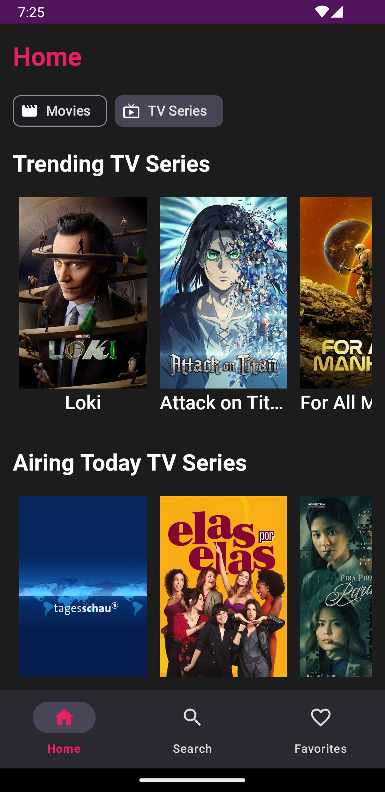

# Movie Time App

In the Movie Time app, you can see popular, now playing, upcoming and trending movies and TV series. 
You can search for the movie or TV series you want, look at the details and add them to your favorites.

## Screenshots

### Dark
***

### Light
***

## Technologies used in this application
- MVVM Architecture
- Navigation Components
- Lifecycle
- Hilt for Dependency Injection
- Coroutines
- Retrofit
- Room Database
- Glide
- Facebook Shimmer Effect
- Intuit Sdp
